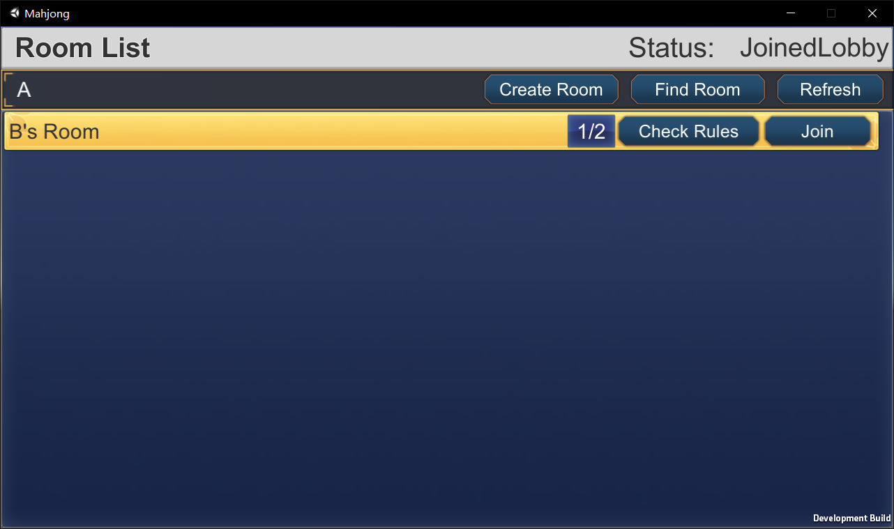
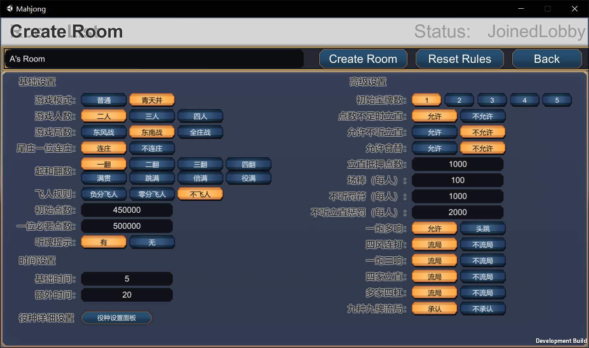
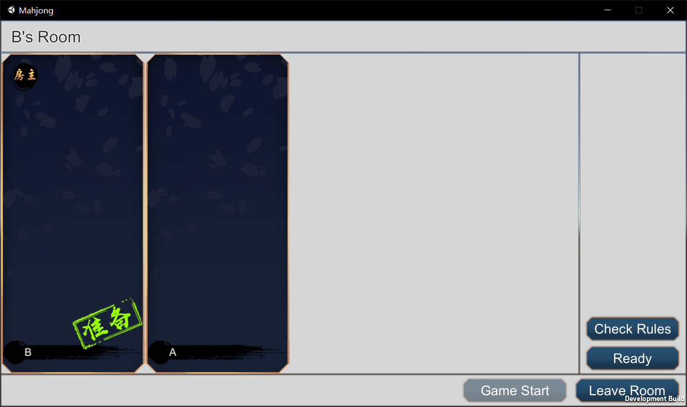
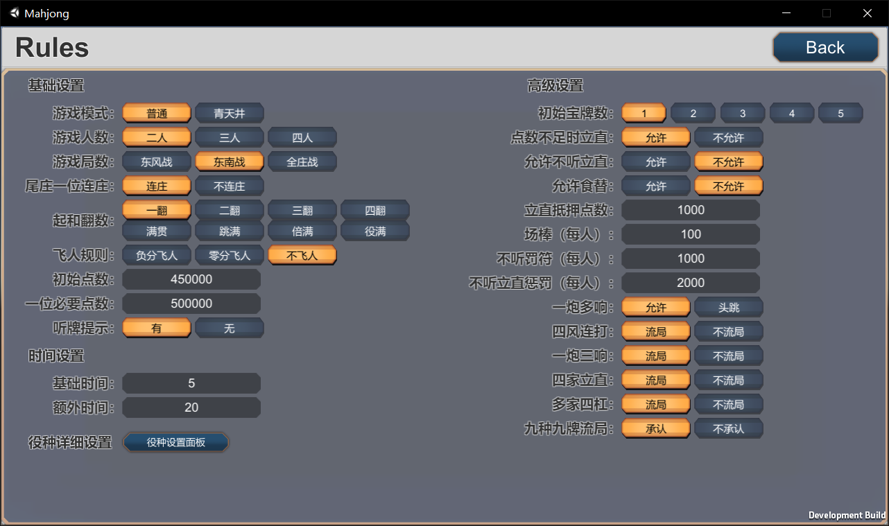
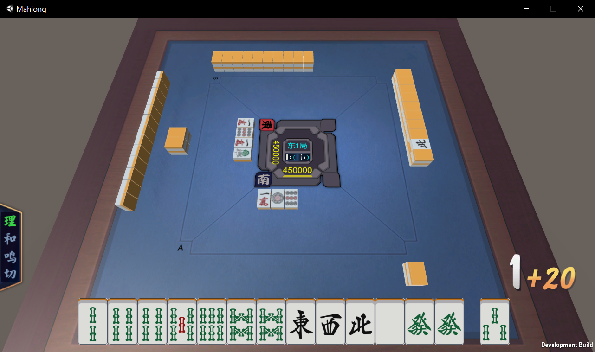
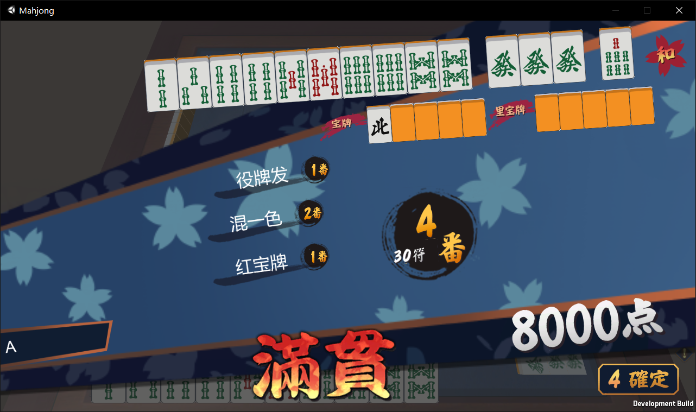

# Mahjong

A working in progress internet Japanese mahjong game made with unity.

The resources using in this game are fetched from the online web game [Majsoul](http://www.majsoul.com/0/).

## Screen shots

Lobby scene

Create a room and set rules

In a room

Checking rules of this room

Playing mahjong! (Full support for 2,3,4 players)

Summary points

